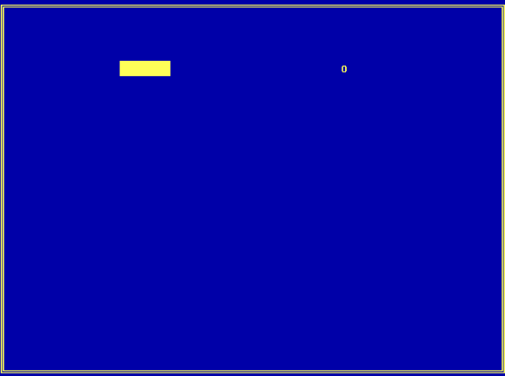

# snake

This is a small game I wrote some day (the archive file date said 2001, but I believe it may have been before that) - it's a nice, cute Nibbles-like game in only 377 bytes (written in 100% assembly). You could even put it in your MBR or something. Maybe someone will learn something from this stuff; it still runs fine on modern computers!

## Screenshot

## Downloads

 * [Source code and executable](releases/snake.zip) (4KB)
